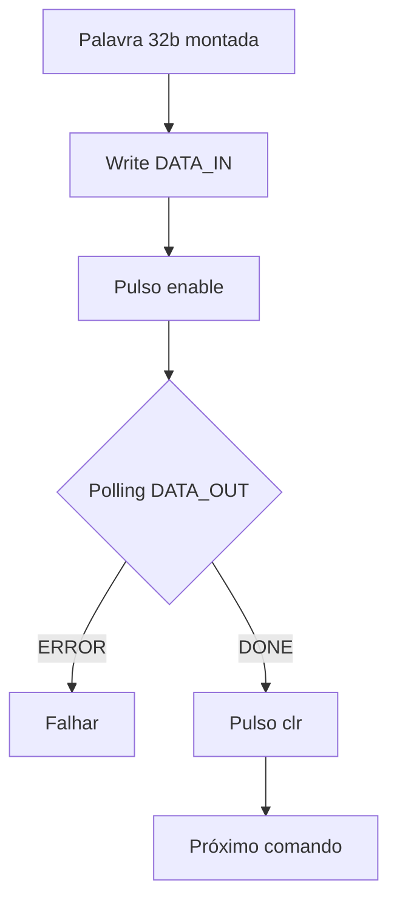
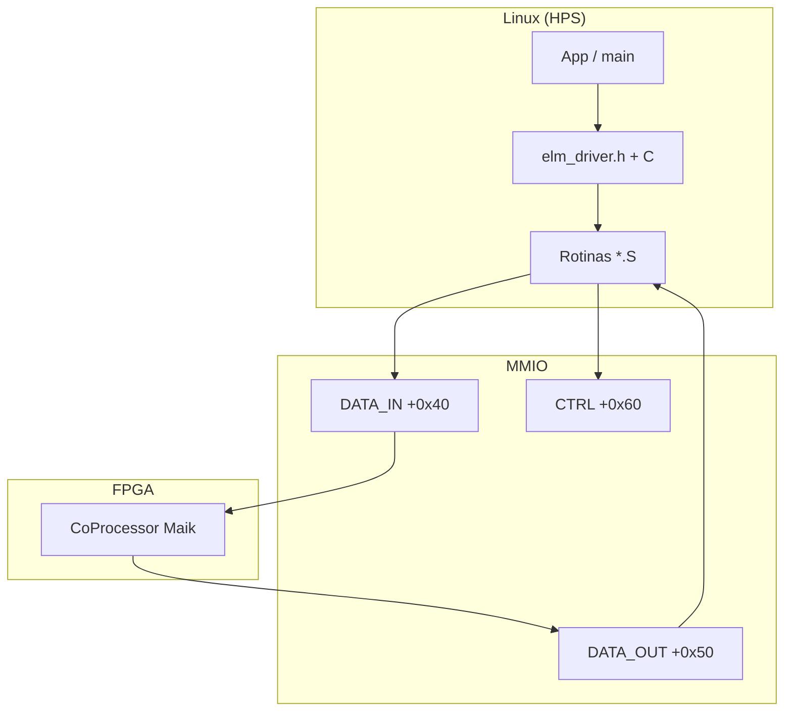

<div align="center">

# API MMIO · Coprocessador ELM ·

**Linux (HPS) + C · ARM Assembly · Quartus · PIO MMIO**

[Estrutura no *hardware*](#estrutura-implementada-no-hardware) ·  
[Estruturação (registos, E/S e palavras 32 bit)](#estruturacao-registadores-formato) ·  
[Funções da API](#funcoes-da-api)

</div>


---

<a id="sumario-expansivel"></a>

## Estrutura implementada no *hardware*

<a id="estrutura-implementada-no-hardware"></a>

<details>
<summary><strong>Abrir: Quartus · projeto SoC · 3 PIOs MMIO ligados ao coprocessador Maik</strong></summary>

<a id="nota-hardware-quartus"></a>

<details>
<summary><strong>📂 Projeto de síntese (FPGA) no Quartus</strong></summary>

O repositório inclui o *hardware* integrado ao **SoC** (Intel Cyclone V SoC):

- **Quartus Prime** (Intel).
- Projeto: **`soc_system.qpf`** na **raiz** do repositório (**File → Open Project…** → escolher esse `.qpf`).

A documentação de RTL e ISA do Maik continua principalmente em **`readme_maik.md`** (raiz).

---
</details>

<details>
<summary><strong>⚙️ O que acrescentámos ao Qsys/Quartus (3 PIOs na Lightweight Bridge)</strong></summary>

Na **LW FPGA-to-HPS bridge**, mapeação típica com **base `0xFF200000`**, foram ligados **três PIOs** com **offsets fixos** usados pelo *driver*:

| PIO (*nome lógico*) | Bits | Vista **Linux / `mmap`** | Ligação ao **`CoProcessor` Maik** |
|---------------------|-----:|----------------------------|-----------------------------------|
| **`data_in`** | 32 | **Escrita**: palavra de **comando ISA** (32 bit). | **`data_in[31:0]`**  |
| **`data_out`** | 32 | **Leitura**: estado (**BUSY / DONE / ERROR**) + **dígito** inferido (**nibble inferior**). | **`data_out[31:0]`** (RTL). |
| **`ctrl`** | 3 | **Escrita**: pulsos de **enable**, **clear** da operação, **reset**. | Ligação segundo **`ghrd_top.v`** (**`[0]` enable**, **`[1]` clr_operation**, **`[2]` rst** ). |

> Nos IPs PIO do Qsys, “input/output” pode parecer contra-intuitivo; aqui usamos sempre a **perspectiva do programa no HPS** (o que faz **`write`** / **`read`** em `/dev/mem`).

**Árvore de offsets (relativamente à base LW mapeada):**

```
Base física típica (LW):  0xFF200000UL
├── data_in  @ + 0x40   ( só escrita ISA de 32 bit )
├── data_out @ + 0x50   ( leitura de estado / resultado )
└── ctrl     @ + 0x60   ( pulsos enable / clr / rst )
```


---
</details>

</details>

---

## Estruturação · Registradores, entradas e saídas, formato das palavras

<a id="estruturacao-registadores-formato"></a>

<details>
<summary><strong>Abrir: mapa MMIO · <code>DATA_IN</code> / <code>CTRL</code> / <code>DATA_OUT</code> · handshake · formato ISA 32 bit · diagramas</strong></summary>

### Visão rápida

Tudo neste bloco é a **estrutura de software sobre o PIO**: endereços, o que vai em cada porta, máscaras e o **campo‑a‑campo** das palavras de 32 bit aceitas pelo coprocessador. Não precisa memorizar bitwise se usar a camada [**Funções da API**](#funções-da-api).

---

<details>
<summary><strong>🔗 Constantes e mapa LW (<code>#define</code> do *driver*)</strong></summary>

<a id="anchors-mmio"></a>

```c
#define LW_BASE       0xFF200000u   /* região LW típica DE1‑SoC / Cyclone V SoC */
#define DATA_IN_OFF   0x40u
#define DATA_OUT_OFF  0x50u
#define CTRL_OFF      0x60u
```

*(Valores usados na prática: **`mmap_lightweight`** em **`elm_store_img.c`**.)*

---
</details>

<details>
<summary><strong>🔗 «Data In» / registo PIO <code>data_in</code> (entrada da palavra ISA)</strong></summary>

<a id="anchors-data-in"></a>

O **`data_in`** é o único canal MMIO onde o programa **deposita cada instrução de 32 bit** que o coprocessador vai processar (**STORE_IMG**, **STORE_WEIGHTS_ADDR**/**VALUE**, **STORE_BIAS**, **STORE_BETA**, **START**, …). Do ponto de vista do *software*:

**`OFFSTE 0X40`**.

---
</details>

<details>
<summary><strong>🔗 <code>CTRL</code> — entrada de controlo (3 bit)</strong></summary>

Escrita apenas pelo HPS, **offset `0x60`**. 

- **`[0]`** — **`enable`** (pulso alto → baixo entre comandos ISA).
- **`[1]`** — **`clr_operation`** (pulso para limpar **DONE**/**ERROR**, etc.,).
- **`[2]`** — **`rst`** (uso em **`elm_reset.S`**: volta o coprocessador a estado conhecido).

---
</details>

<details>
<summary><strong>🔗 Estrutura <code>elm_ports_t</code> e <code>mmap</code> sobre <code>/dev/mem</code></strong></summary>

<a id="anchors-elm-ports-t"></a>

Declarada em **`elm_driver.h`**; **`fill_ports()`** obtém ponteiros **volátil** porque o alvo não é DRAM normal:

```c
typedef struct {
    volatile uint32_t *data_in;
    volatile uint32_t *ctrl;
    volatile uint32_t *data_out;
} elm_ports_t;
```

1. **`open("/dev/mem", …)`**
2. **`mmap()`** (READ | WRITE, MAP_SHARED sobre **`LW_BASE`**).
3. **`data_in` / `ctrl` / `data_out`** = **`mapped`** + **`0x40` / `0x60` / `0x50`**.

utlizamos **`sudo`** (privilégios para PFN físicas).

<details>
<summary><strong>Por que <code>volatile uint32_t *</code></strong></summary>

Cada **`read`** / **`write`** é um acesso PIO real através do MMU — o compilador **não** pode assumir valores “estáveis” como se fosse ram local.

---
</details>

---
</details>

<details>
<summary><strong>🔗 <code>DATA_OUT</code> · saída de estado · máscaras e *helpers*</strong></summary>

<a id="data-out-mascaras"></a>

<details>
<summary>Origem RTL </summary>

```verilog
assign data_out_maik = {
    zeros_higher,
    fl_error,
    fl_processor_busy,
    fl_processor_done,
    predicted_digit_register[3:0]
};
```

**Bits mais usados pela API:**

| Bits | Significado habitual |
|:---:|:---|
| `[3:0]` | **Dígito** (**após inferência** quando **DONE** está activo). |
| `4` | **DONE** |
| `5` | **BUSY** (ex.: esperar baixo entre **STORE_WEIGHTS_ADDR** e VALUE) |
| `6` | **ERROR** |

---
</details>

<a id="mascaras-data-out-bits"></a>

```17:21:ZRR/elm_driver.h
#define ELM_MASK_DONE           (1u << 4)
#define ELM_MASK_BUSY           (1u << 5)
#define ELM_MASK_ERROR          (1u << 6)
#define ELM_MASK_PREDICTED_DIG  (0xFu)
```

Após ler **`*ports->data_out`** aplica‑se sempre **`&`** com estas máscaras.
**`OFFSTE 0X50`**.

<details>
<summary><strong>Helpers em <code>elm_driver.h</code></strong></summary>

<a id="helpers-inline-elm_ports_t"></a>

**`elm_ports_data_out_read`**, **`elm_busy_wait_cleared`** (espera **BUSY**), **`elm_ports_predicted_digit`** (**`*data_out & 0xF`**) nas linhas ~`45–58`.

---
</details>

---
</details>

<details>
<summary><strong>🔗 Protocolo handshake MMIO (enable → poll <code>data_out</code> → clr)</strong></summary>

<a id="protocolo-mmio-maik"></a>

<p align="center">
  
  <br /><em>Transacção MMIO típica (escrita em <code>DATA_IN</code>, pulso <code>enable</code>, <code>BUSY</code>/<code>DONE</code>, <code>clr</code>).</em>
</p>

1. Escreve a **instrução 32 bit** em **`DATA_IN`**.
2. **`CTRL`** — **`enable`** momentâneo (alto→baixo).
3. **No ciclo:** lê **`DATA_OUT`** até **DONE** (ou erro); quando aplicável, vigiar também **BUSY** (**STORE_WEIGHTS** ADDR/VALUE).
4. Pulso **`clr_operation`** (**valor `2`**) e volta **`0`** para liberar nova operação (**evita DONE “colado”**).

```plaintext
ADDR (assembly) ──► elm_busy_wait_cleared() (C) ──► VALUE (assembly)
```



---
</details>

<details>
<summary><strong>🔗 Tamanhos típicos dos ficheiros <code>.raw</code></strong></summary>

<a id="capacidades-raw-tipicos"></a>

| Memória FPGA (README Maik) | Entradas | Bytes `.raw` LE típicos |
|---|---:|---:|
| **Mem_img** (**STORE_IMG**) | **784 × uint8** | **784** |
| Pesos ocultos (Win) | **100 352 × uint16** | **200 704** |
| **Mem_bias** | **128 × uint16** | **256** |
| **Mem_beta** | **1 280 × uint16** | **2 560** |

---
</details>

<details>
<summary><strong>🔗 Formato das palavras 32 bit (ISA Maik)</strong></summary>

<a id="formatos-is-32-maik"></a>


<details>
<summary><strong>STORE_IMG opc <code>3'b000</code></strong></summary>

```
 31 ───────────── 21   20─────13    12─────3      2─0
┌──────────────────┬──────────┬──────────┬───────┐
│ (não usado aqui) │ pixel 8b │ índ img  │ 000   │
└──────────────────┴──────────┴──────────┴───────┘
```

**Índices** `0…783`. **Asm:** **`elm_store_pixel.S`** · **C:** **`send_img784`** + **`elm_store_img_pixel`**.

---
</details>

<details>
<summary><strong>STORE_WEIGHTS_ADDR / VALUE <code>001</code> · <code>010</code></strong></summary>

**ADDR:**

```
 31 ────── 20  19──────────3   2-0
┌────────────┬──────────────┬────┐
│ reservado  │ endereço Win │001 │
└────────────┴──────────────┴────┘
```

**VALUE:**

```
 31 ─── 19  18──────3   2-0
┌────────┬──────────┬────┐
│ reserv │ Q4.12    │010 │
└────────┴──────────┴────┘
```

**C:** **`elm_store_weights_win_raw`** → ADDR → **`elm_busy_wait_cleared`** → VALUE · **Asm:** **`elm_store_weights.S`**.

---
</details>

<details id="instrucao-store-bias-mmio">
<summary><strong>STORE_BIAS <code>011</code></strong></summary>

Alinhado com **`elm_store_bias.S`**: opcode **`[2:0]=011`**, **índice** em **`[9:3]`** (**7 bit**, `0…127`), **valor 16 bit** (fundo do `uint32_t` do parâmetro C) em **`[25:10]`**.

```
 31────26  25──────10   9────3   2-0
┌──────┬──────────┬──────┬────┐
│ res  │ bias 16b │idx7b │011 │
└──────┴──────────┴──────┴────┘
```

**C:** **`elm_store_bias`**, **`elm_store_bias_raw`** · **Asm:** **`elm_store_bias.S`** (monta a palavra, **enable**, **poll DONE/ERROR**, **clr**).

---
</details>

<details>
<summary><strong>STORE_BETA <code>100</code></strong></summary>

```
 31──30 29──────14 13────3 2-0
┌────┬──────────┬──────┬───┐
│res │ valor 16 │idx11 │100│
└────┴──────────┴──────┴───┘
```

**`elm_store_beta.S`**.

---
</details>

<details>
<summary><strong>START opc <code>101</code> (literal decimal <code>5</code>)</strong></summary>

**`elm_inference_start.S`** (barreira **`dsb sy`**, clr antecipada, polling **DONE**).

---
</details>

---
</details>

<details>
<summary><strong>🔗 Fluxogramas</strong></summary>

<a id="fluxogramas-mermaid"></a>




---
</details>

</details>

---

## Funções da API

<a id="funcoes-da-api"></a>

<details>
<summary><strong>Abrir: mapa C ↔ Assembly · *wrappers* · <code>main</code> e <code>pipeline_upload_all</code></strong></summary>

<p align="center">
  
  <br /><em>Fluxo de software até ao coprocessador no FPGA (abstracção da API).</em>
</p>


### Camada de abstracção

**`elm_driver.h`**, **`.c`** e **`*.S`** escondem **offsets brutos**, **handshake enable/clr** e **polling** . O usuario faz a chamada das funções tipo **`pipeline_upload_all`**, **`elm_inference_start`**, **`elm_ports_predicted_digit`**, **`etc`**.

---

<a id="mapa-c-assembly-declaradas-em-elmdriverh"></a>

<details open>
<summary><strong>Mapa C ↔ Assembly</strong></summary>

| Chamada típica (C ou `static`) | Assembly / *inline* | Resumo |
|--------------------------------|---------------------|--------|
| **[`send_img784`](#send_img784)** | **`elm_reset`**, **`elm_store_img_pixel.S`** (loop) | Imagem **`.raw`** (**784 B**) · **STORE_IMG**. |
| **`elm_reset`** | **`elm_reset.S`** | **`rst`** no `ctrl`. |
|  |
| **`elm_store_weights_win_raw`** | **`elm_store_weights.S`** + **`elm_busy_wait_cleared`** | **100 352** duplas ADDR/VALUE. |
| **`elm_busy_wait_cleared`** | *inline* **`elm_driver.h`** | Espera **BUSY**. |
| **`elm_store_bias_raw` / bias** | **`elm_store_bias.S`** | **STORE_BIAS**. |
| **`elm_store_beta_raw`** | **`elm_store_beta.S`** | **STORE_BETA**. |
| **`elm_inference_start`** | **`elm_inference_start.S`** | **START**. |
| **`elm_ports_predicted_digit`** | *inline* **`elm_driver.h`** | `data_out & 0xF` após **DONE**. |

Há também **`elm_run_maik_classification(...)`** *(macro pipeline + `mmap`)* descrita no *header*, alternativa ao **`main`** de demonstração.

---
</details>

### Funções (*documentação da API*)

Depois de **`#include "elm_driver.h"`** e de ter **`elm_ports_t`** apontando para a janela **`mmap`** correta (**`data_in`** / **`ctrl`** / **`data_out`**), estas são as funções em **C** que coordenam o coprocessador: cada uma delega em **assembly** a montagem da **palavra 32 bit**, a **escrita** em **`DATA_IN`**, o **pulso `enable`** em **`CTRL`**, o **polling** de **`DATA_OUT`** e, quando necessário, o **pulso `clr`**.

<details>
<summary id="elm_reset"><strong><code>elm_reset</code></strong></summary>

**Como chamar (C):** `int elm_reset(elm_ports_t *ports);`

- **Parâmetros:** **`ports`** — mesma estrutura usada em todas as rotinas (ponteiros **MMIO** válidos).
- **Efeito esperado:** volta o coprocessador a um estado conhecido antes de envios (ex. antes de **`send_img784`**).

**Assembly (`elm_reset.S`):** escreve **`4`** em **`*ctrl`** (**bit `rst` alto**, conforme mapeamento habitual **`[2]=rst`**) e de seguida **`0`**, produzindo um **pulso de *hardware reset***.

**Retorno:** **`0`** em sucesso.

---
</details>

<details>
<summary id="elm_inference_start"><strong><code>elm_inference_start</code></strong></summary>

**Como chamar (C):** `int elm_inference_start(elm_ports_t *ports);`

- **Pré-condição:** memórias da rede já carregadas (**imagem**, **Win**, **bias**, **beta**) conforme a ordem descrita no **`main`** / **`pipeline_upload_all`**.
- **O que faz:** dispara a **inferência** (**instrução START**, opcode **`101`** nos **`[2:0]`**, valor **`5`** na palavra).

**Assembly (`elm_inference_start.S`):**  
1. Espera **BUSY** baixo (**copro livre / IDLE**).  
2. Pulsa **`clr_operation`** (**valor `2`** em **`ctrl`**, **`0`**) com **`dsb sy`** (**barreira** de consistência antes de novos comandos).  
3. Espera **DONE** baixo (limpando *flags* residuais de operações anteriores).  
4. Escreve a palavra **START** em **`data_in`**, **enable** alto→baixo.  
5. Faz polling de **`DATA_OUT`**: **ERROR** → retorna **`−2`**; espera **DONE** alto (**inferência terminou**).  
6. Pulsa outra vez **`clr`** e retorna **`0`**.

Depois disto usa **`elm_ports_predicted_digit(ports)`** para ler o **dígito** nos **`[3:0]`** de **`data_out`**.


---
</details>

<details>
<summary id="elm_store_img_pixel"><strong><code>elm_store_img_pixel</code></strong></summary>

**Como chamar (C):**  
`int elm_store_img_pixel(elm_ports_t *ports, unsigned pixel_gray, unsigned img_index);`

- **`pixel_gray`** — intensidade **`0…255`** de **um** píxel **MNIST**/784.  
- **`img_index`** — posição **`0…783`** na **Mem_img** do FPGA.

**Assembly (`elm_store_pixel.S`):** concatena (**`orr`** + **deslocamentos**) o **opcode `000`**, o **índice** em **`[12:3]`** e o **byte do píxel** em **`[20:13]`**; faz **`str`** para **`data_in`**; **`enable`** `1→0` em **`ctrl`**; em ciclo lê **`data_out`** até **DONE** (ou sai com erro se **ERROR**); pulsa **`clr_operation`** (**`2`→`0`**).

Ou seja: **uma chamada C = um STORE_IMG completo com handshake**.


---
</details>

<details>
<summary id="send_img784"><strong><code>send_img784</code></strong> (<code>elm_store_img.c</code>, <code>static</code>)</summary>

**Pré‑requisitos:** já tens **`ports`** inicializados (não faz **`mmap`** por si).

- Lê **exactamente 784 bytes** de um **`.raw`** de imagem.  
- Chama **`elm_reset(ports)`** e, para **`i = 0…783`**, **`elm_store_img_pixel(ports, buf[i], i)`**.

**Erros:** `-1` abrir ficheiro, `-2` tamanho ≠ 784, **`-10−i`** falha de *hardware* no píxel **i** (valor devolvido por **`elm_store_img_pixel`**).


---
</details>

<details>
<summary id="elm_store_weights_win_raw"><strong>Carga dos pesos <code>W_in</code> — <code>elm_weights_send_addr</code>, <code>elm_weights_send_value</code>, <code>elm_busy_wait_cleared</code>, <code>elm_store_weights_win_raw</code></strong></summary>

- **`elm_weights_send_addr(ports, addr_index)`** — **`addr_index`** em **`0 … 100351`**. **`elm_store_weights.S`**: monta **STORE_WEIGHTS_ADDR** (**opc `001`**), campo de endereço nas posições do RTL (**`«3`**), **`enable`**, **sem** esperar **DONE** .  
- **`elm_busy_wait_cleared(ports)`** — *inline* em C: **while** em **`BUSY`** (**bit 5** de **`data_out`**) até baixar (**necessário** antes do **VALUE**, porque só depois do **BUSY** voltar IDLE é seguro aceitar novo valor).  
- **`elm_weights_send_value(ports, value_q4_12)`** — monta **STORE_WEIGHTS_VALUE** (**opc `010`**), campo **16 bit Q4.12** em **`[18:3]`**, **`enable`**, **polling DONE** + **`clr`**.

**Nível ficheiro:**  
- **`elm_store_weights_win_raw(ports, path_raw)`** — abre **`W_in.raw`**, carrega **`ELM_WEIGHT_RAW_BYTES`**, para cada entrada chama **`send_addr`** → **`elm_busy_wait_cleared`** → **`send_value`**.

**Retornos típicos:** **`0`**, **`−2`** erro *hardware*, **`−3`** endereço fora do intervalo em **`send_addr`**, códigos **`-20…`** do *wrapper* de ficheiro (`elm_store_img.c`).


---
</details>

<details>
<summary id="elm_busy_wait_cleared"><strong><code>elm_busy_wait_cleared</code></strong> (*inline*)</summary>

```c
while (elm_ports_data_out_read(ports) & ELM_MASK_BUSY)
    ;
```

**Uso:** entre **`elm_weights_send_addr`** e **`elm_weights_send_value`** (e em qualquer situação em que o coprocessador exija **“BUSY baixo”** antes do próximo comando dependente).


---
</details>

<details>
<summary id="elm_store_bias"><strong><code>elm_store_bias</code> / <code>elm_store_bias_raw</code></strong></summary>

**Em C:**  
- **`int elm_store_bias(elm_ports_t *ports, unsigned addr, unsigned value_q4_12_16bit);`** — **`addr`** **`0…127`**, **`value`** **16 bit** (semelhante ao formato no RTL).  
- **`int elm_store_bias_raw(ports, path_raw)`** — lê **`ELM_BIAS_RAW_BYTES`** de **`b.raw`** (ou equivalente) e invoca **`elm_store_bias`** para cada posição.

**Assembly (`elm_store_bias.S`):** forma **STORE_BIAS** (**opc `011`**: índice **`[9:3]`**, dado **`[25:10]`**), **`enable`**, **poll DONE/ERROR**, **`clr`**.


---
</details>

<details>
<summary id="elm_store_beta"><strong><code>elm_store_beta</code> / <code>elm_store_beta_raw</code></strong></summary>

**Em C:**  
- **`int elm_store_beta(elm_ports_t *ports, unsigned addr, unsigned value_q4_12_16bit);`** — **`addr`** **`0…1279`**.  
- **`elm_store_beta_raw`** — lê **`ELM_BETA_RAW_BYTES`** de **`beta.raw`** e envia todas as entradas.

**Assembly (`elm_store_beta.S`):** **STORE_BETA** (**opc `100`**: índice **`[13:3]`**, dado **`[29:14]`** conforme comentário no `.S`), mesmo padrão **enable → poll → clr**.


---
</details>

<details>
<summary id="elm_ports_predicted_digit"><strong><code>elm_ports_predicted_digit</code></strong> (*inline*)</summary>

**Assinatura:** `unsigned elm_ports_predicted_digit(elm_ports_t *ports);`

- **Sem assembly dedicado:** lê **` *ports->data_out`** em C e devolve **`& ELM_MASK_PREDICTED_DIG`** (**nibble** `0–9`).
- **Só é válido** depois de uma inferência bem sucedida com **DONE** ativo.


---
</details>

---
<a id="main-e-pipeline"></a>

### `main` e **`pipeline_upload_all`** (**`elm_store_img.c`**)

Uso simples **`START`**: **imagem → Win → bias → beta**.

```248:274:ZRR/elm_store_img.c
static int pipeline_upload_all(elm_ports_t *ports,
                               const char *path_img_raw,
                               const char *path_win_raw,
                               const char *path_bias_raw,
                               const char *path_beta_raw)
{
    ...
    rc = send_img784(ports, path_img_raw);
    ...
    rc = elm_store_weights_win_raw(ports, path_win_raw);
    ...
    rc = elm_store_bias_raw(ports, path_bias_raw);
    ...
    rc = elm_store_beta_raw(ports, path_beta_raw);
    return rc;
}
```

O **`main`** faz **`mmap`**, **`pipeline_upload_all`**, **`warm-up`** com **`elm_inference_start`**, e opcionalmente **N** inferências com **`clock_gettime`** (**`-lrt`**).

---
</details>

---

---

## Autores:
**Henrique Zeu Sa de Moura**, 
**Ricardo Vilas-Bôas Gomes**


---

<div align="center">


</div>
